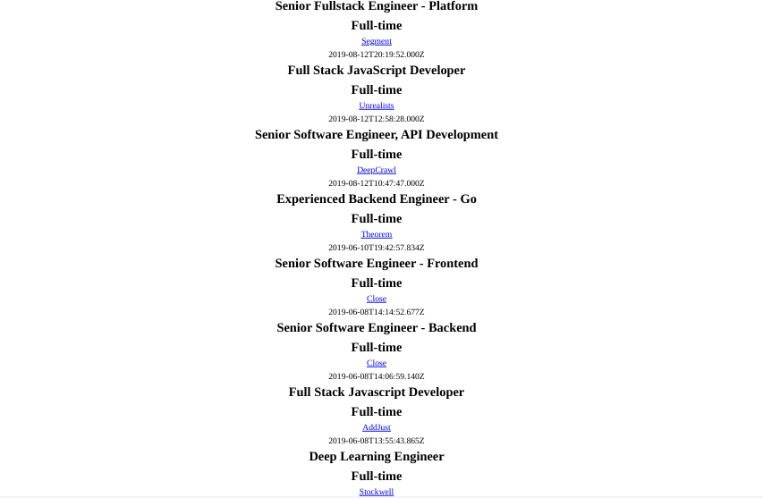

<h1 align="center">Jobs App Challenge</h1>

   Solution for a challenge from  <a href="http://devchallenges.io" target="_blank">Devchallenges.io</a>.

  <h3>
    <a href="https://legacy.devchallenges.io/challenges/TtUjDt19eIHxNQ4n5jps">
      Challenge
    </a>
  </h3>

## Table of Contents

- [Overview](#overview)
  - [Built With](#built-with)
- [Features](#features)
- [Useful Resources](#useful-resources)

## Overview

***

### Built With

- [Create React App](https://github.com/facebook/create-react-app)
- [React](https://reactjs.org/)
- [GraphQL Jobs](https://graphql.jobs/docs/api/)
- [Apollo Client](https://www.apollographql.com/docs/react/)

## Features

This application/site was created as a submission to a [DevChallenges](https://devchallenges.io/challenges) challenge. The [challenge](https://legacy.devchallenges.io/challenges/TtUjDt19eIHxNQ4n5jps) was to build an application to complete the given user stories.

## Thoughts

Job Apis are scarce and don't seem to last.  Found this api from [Github](https://github.com/public-api-lists/public-api-lists).  Didn't want to bother with api keys and I thought it would be nice to use graphql for a change.  Of course, the api is pretty barebones, abandoned, and only seems to be left up for resume purposes.  It allows mutations to add job listings.  But you can't do much flexible querying (No pagination).  So it is impossible to add all the devchallenge requirements.  Lucky, I didn't spend much time but I learned a lot of interesting things in my research of the challenge.  I will explore more job apis and hopefully find a suitable replacement.   

Could use data-fns and its format function to easily convert the postedAt to a more readable date.  

## Useful Resources

- [Steps to replicate a design with only HTML and CSS](https://devchallenges-blogs.web.app/how-to-replicate-design/)
- [YouTube](https://www.youtube.com/watch?v=_DhYAk4Iy-0) - Pagination with Apollo Client
- [YouTube](https://www.youtube.com/watch?v=rAuEmI1Fat8) - React Router Pagination
- [Apollo GraphQL](https://www.apollographql.com/docs/react/pagination/offset-based) - pagination
- [YouTube](https://www.youtube.com/watch?v=kMuRr53RjcE) - React-Paginate tutorial
- [Blog](https://www.apollographql.com/blog/graphql/filtering/how-to-search-and-filter-results-with-graphql/) - filter results
- [YouTube](https://www.youtube.com/watch?v=DAiXXdGJjvQ) - useQuery hook
- [Stack Overflow](https://stackoverflow.com/questions/63041747/how-to-pass-nested-variables-to-the-graphql-query-in-apollo) - nested variables
